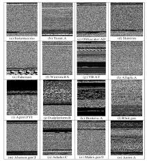

# Deep Android Malware Analysis

CNN based malware detection system to detect malware in android apps by performing static analysis of apk files. APKs are decompiled to using androguard to obtain Dalvik-Bytecode. The generated code files are analysed for static features such as permission, intents, activities etc.

These obtained Dex files are translated to grayscale images without modifying the original apps. Using these images, a CNN model is trained to identify malicious patterns in the apps.

